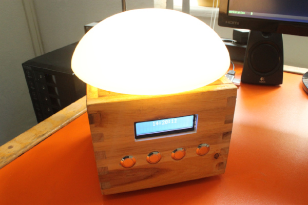

Sunrise Alarm Clock
===================

This is a wake-up light that simulates the sunrise by gradually increasing the brightness of its LED lamp during a configurable span before the alarm time.

These wake-up lights are produced by a number of manufacturers, but here we are building our own using a Raspberry Pi, a handful of electronic components,
the programming language Elixir and Nerves , an Elixir framework for developing embedded systems.

Documentation of this project can be found on my website: http://www.grappendorf.net/projects/sunrise-alarm-clock/
